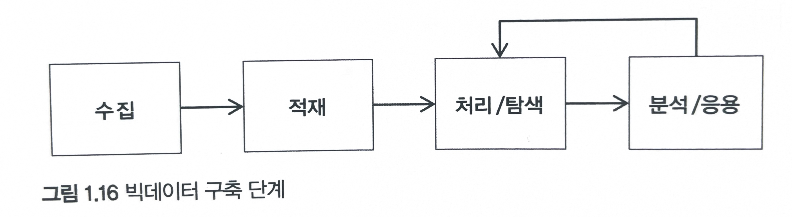

# Introduction
최초 작성일 : 2024-01-22  
마지막 수정일 : 2024-01-26
  
## 0. Overview

여기에서는 빅데이터에 전반적인 내용을 다룬다.

## Table of Contents

1. [Big Data Definition](#1.-Definition-of-Big-Data)
2. [Big Data Objectives](#2.-Big-Data-Objectives)
3. [Big Data Utilization](#3.-Utilization-of-Big-Data)
4. [Big Data Project](#4.-Definition-of-Big-Data)
5. [Big Data Technology Evolution](#5.-Big-Data-Technology-Evolution)
6. [Big Data Implementation Technology](#6.-Big-Data-Implementation-Technology)
7. [Big Data Role and Responsibilities](#7.-Big-Data-Role-and-Responsibilities)
8. [Big Data Security](#8.-Big-Data-Security)

## 1. Definition of Big Data

빅데이터를 단순히 큰 데이터, 큰 정보라만 보지 않는다. 과거부터 현재까지 쌓인 데이터를 분석해 현재를 이해한다. 데이터에서 만들어 다양한 패턴을 해석해 미래를 예측하기 시작하였다.

빅데이터는 다음 6V로 정의하며, 6V는 빅데이터와 관련되어 중요한 키워드로 자리잡고 있다.

- Volume (양): 빅데이터는 대량의 데이터를 다루는 것
- Velocity (속도): 데이터가 빠른 속도로 생성되고 전달되는 특성
- Variety (다양성): 다양한 종류의 데이터 유형과 형식을 포함
- Veracity (정확성): 데이터의 정확성과 신뢰성
- Value (가치): 데이터로부터 가치를 추출하고 활용하는 능력
- Variability (변동성): 데이터의 변동성 및 불규칙성을 다루며, 데이터의 빠른 변화

이러한 6가지 "V"는 빅데이터의 주요 특성을 설명하는데 도움을 주며, 빅데이터 분석 및 활용에 대한 방향성을 제시하는데 사용한다. 결론적으로, 위 6V를 통해 보편적으로 빅데이터는 

*현재 이 순간에도 방대한 크기(Volume)의 다양한(Varity) 데이터들이 빠른 속도(Velocity)로 발생하고 있다. 빅데이터는 3V(Volume, Varity, Velocity)를 수용하며, 데이터의 진실성(Veracity)을 확보하고, 분석 데이터를 시각화(Visualization)함으로써 새로운 효익을 가져다 줄 가치(Value)를 창출하는 것*

으로 정의된다.

## 2. Big Data Objectives
성공적인 빅데이터의 시스템의 구축과 운영을 위해, 데이터, 사람, 기술을 고려해야한다. 빅데이터 시스템을 통해 정보를 제공하여, 최종적으로, 다음 3가지와 같은 의사결정 인사이트를 발견하는데 그 목적이 있다.

- 비용 절감 인사이트
- 수익 창출 인사이트
- 문제 해결 인사이트

그렇다면, 빅데이터의 인사이트는 무엇일까 ? 빅데이터의 인사이트는 통찰력이라고 하며, 현상을 이해하는 인사이트, 현상을 발견하는 인사이트, 현상을 예측하는 인사이트로 나뉜다. 현상의 이해는 대규모 데이터로부터 통계량을 산출하고, 과거에 발생한 일에 대한 원인을 분석하는 것이다. 현상의 발견은 데이터의 패턴을 발견하고,해석하고, 해석을 통해 현재 발생하는 일을 분석하는 인사이트라 할 수 있다. 마지막으로, 현상 예측 인사이트는 현재 발생하고 있는 일을 모형에 적용하고, 미래에 발생할 현상을 예측하는 인사이트이다.  

## 3. Big Data Utilization
빅데이터는 넓은 영역에서 다음 3가지 방법으로 활용된다.

- 상품/서비스 : 빅데이터를 상품/서비스 개발 및 개선에 활용
- 마케팅 지원 : 빅데이터를 대규모 고객 및 시장 분석에 활용
- 리스크 관리 : 빅데이터를 리스크 검출 및 예측 분석에 활용

## 4. Big Data Project
빅데이터는 크게 다음 3가지의 유형이 존재한다.

- 플랫폼 구축형 프로젝트
- 빅데이터 분석 프로젝트
- 빅데이터 운영 프로젝트

### 4.1. Platform Development Project
전형적인 빅데이터 SI(System Integram)를 구축하는 사업을 의미하며, 빅데이터의 하드웨어와 소프트웨어를 설치하고 구현함으로써, 수집, 적재, 처리, 탐색, 분석과 같은 일련의 과정을 구현하는 것을 의미한다. 규모에 따라 차이가 나지만, 대게 3~6개월 정도로 프로젝트 기간이 계획된다. 또한, 데이터 저장소가 설계되고 난 후, 다른 저장소에 있는 데이터를 migration하는 작업도 포함될 수 있다.

### 4.2. Big Data Analysis Project
빅데이터 플랫폼 구축 완료 후 수행이 되는 프로젝트로, 빅데이터 탐색으로 데이터의 이해가 높아 질때, 시작한다. 약 1~3개월 일정으로 추친되고, 분석주제영역은 마케팅/고객 분석, 상품/서비스 개발, 리스크 관리를 주제로 프로젝트가 진행된다.

### 4.3. Big Data Operations Project
구축 완료된 플랫폼을 중장기적으로 유지 관리하는 것을 의미한다. 대규모 하드웨어/소프트웨어로 운영 비용이 높다는 것이 특징이다. 대규모 하드웨어/소프트웨어/네트워크가 분산 환경으로 구성되어 있고, 많은 에러와 이슈들이 발생한다. 또한, 오픈 소스 프레임워크들의 업데이터와 기술 발전 속도가 빠르기 때문에 업그레이드와 패치가 빈번히 발생한다. 이러한 이유로, 빅데이터 분야별 전문가 그룹이 확보되는 것이 요구된다.

## 5. Big Data Technology Evolution
초기에는 빅데이터를 Storage(저장소)의 역할로만 기술이 발전이 되었지만, 이후, 이머징 기술이 따라 빠른 발전를 맞게 되었다. 빅데이터의 기술 변화는 아래 그림과 같다.

초기에는 대용량 저장소와 대규모 배치 처리 기술이 집중이 되었다. 이 후, 실시간 처리와 온라인 분석 기술이 발전이 되었고, 현재는 전처리 및 분석 마트, 고급 분석 및 마이닝에 초점이 맞춰 발전하고 있다. 특히, 빅데이터 기술의 중심에는 Hadoop이라는 프레임워크가 존재한다.

## 6. Big Data Implementation Technology
빅데이터를 처리하는 단계는 수집-적재-처리-탐색-분석-응용이며, 이 단계를 처리하기 위한 기술과 프레임워크가 매우 다양하다.

### 6.1. Collection  
빅데이터의 수집 기술은 조직의 내/외부의 다양한 시스템으로부터 원천 데이터를 효과적으로 수집하는 기술이다. 빅데이터 수집에는 기존의 수집 시스템에서 다뤘던 데이터보다 더 크고 다양한 형식의 데이터를 빠르게 처리해야 하기 때문에 분산 기능의 선형적 확장이 필요한 것이 특징이다. 빅데이터의 수집기는 원천 시스템의 다양한 인터페이스 유형, 데이터베이스, 파일, API, 메세지 등과 연결되어 정형/비정형 데이터를 대용량으로 수집한다. 특히, 외부데이터 소셜 미디어, 블로그, 포털, 뉴스 등의 데이터를 수집 크롤링과 NLP 등 비정형 처리를 위한 기술이 선택적으로 적용된다. 수집처리에는 대용량 파일 수집과 실시간 스트림 수집으로 나눌 수 있는데, 실시간 수집의 경우에는 CEP 컴플렉스 이벤트 프로세싱, ESP 이벤트 스트림 프로세스 기술이 적용되어 수집 중인 데이터로부터 이벤트를 감지해 빠른 후속 처리를 수행한다.

### 6.2. Storage  
수집한 데이터를 분산 스토리지에 영구/임시 저장하는 기술이다. 빅데이터 분산 저장소로는 크게 4가지 유형이 존재한다.

첫 째, 대용량 파일 전체를 영구적으로 저장하기 위한 HDFS, 둘 째, 대규모 메세징 데이터 전체를 영구 저장하기 위한 NoSQL, HBase, MongoDB, Cassandra, 세 번째로는, 대규모 메세징 데이터를 일부만 저장하기 위한 In-Memory, Cache, Redis, Memcached, Infinite, Span 등, 마지막으로, 대규모 메세징 데이터 전체를 버퍼링 하기 위한 Message Oriented Middleware(i.e. MOM)라는 Kafka, Rebit MQ, ActiveMQ 등이 있다.

빅데이터 적재 기술은 수집된 데이터의 성격에 따라 적재 저장소를 구분하여 유형별로 저장해야 한다. 예를 들어, 대용량 파일 적재는 주로 HDFS 저장소를 사용하면 되지만, 실시간 및 대량으로 발생하는 작은 메세지 데이터를 HDFS에 저장할 경우, 타일 수가 기하급수적으로 증가하여, 관리 노드와 병렬 처리의 효율성이 크게 떨어진다.
 
 빅데이터가 적재될때는 추가적으로 전처리 작업이 수행되기도 하는데, 탐색 분석 단계를 위한 비정형, 음성, 이미지, 텍스트, 동영상 데이터를 정형 데이터로 가공하거나 개인 정보로 판단되는 데이터를 비식별 처리하는 작업도 포함이 된다.

### 6.3. Processing/Exploration 
빅데이터 처리/탐색 과정은 대용량 저장소에 적재된 데이터를 분석에 활용하기 우해 데이터를 정형화 정규화를 하는 기술이다. 이 과정에서 적재된 빅데이터를 지속적으로 관찰하는 탐색적 분석과 탐색 결과를 정기적으로 구조화하는 작업을 수행한다. 특히,데이터를 탐색, 선택, 변환, 통합, 축소 등의 작업을 수행하고, 내부의 정형/비정형 데이터를 결합해 기존의 기술적 관계로 만들지 못했던 새로운 데이터 셋 생성하는 중요한 단계를 포함하기도 한다. 또한, 정기적으로 발생하는 처리 탐색의 과정을 워크플로우로 프로세스화해서 자동화하고, 워크플로우 작업이 끝나면 이 데이터셋들을 특화된 데이터 저장소, 데이터 마트 등으로 옮겨져 데이터셋의 측정 가능한 구조로 만들어지게 함으로써 빅데이터 분석을 빠르고 정화갛게 해주는 역할을 수행하게 된다.

### 6.4. Analysis/Application
분석 기술은 대규모 데이터로부터 새로운 패턴을 찾고, 그 패턴을 해석해서 통찰력을 확보하기 위한 기술이다. 빅데이터 분석은 활용 영역에 따라 통계, 데이터 마이닝, 텍스트 마이닝, 소셜미디어 분석, 머신러닝 분석, 딥러닝 분석 등으로 분류된다. 특히, 분산 환경 위에서 머신 러닝 기술을 구현해 군집, 분류, 회귀, 추천 등의 고급 분석 영역까지 확장할 수 있다.

## 7. Big Data Role and Responsibilities
R&R 혹은 Role and Responsibilities는 역할과 책임를 의미한다. 다시 말해, 기업 조직에서 개별 프로세스 및 조직의 구성원들이 수행해야할 '역할'과 그 역할의 수행에 따른 '책임' 관계를 뜻한다. 빅데이터 AI 시스템이 대규모로 구성되기 때문에 다양한 역할과 책임 그리고 관계 부서들로 이루어진 시스템으로 구성된다. 이때 가장 중요한 것은 빅데이터에 사용되는 기술을 잘 알고 구현하는 것보다 빅데이터 AI 시스템의 관계자들, 즉, 분석가, 모델러, 인프라 담당자, 데이터 엔지니어, 업무 담당자, 관리자, 기획자 등의 커뮤니케이션과 협업이다. 결코 개발자나 IT 인프라 담당자만으로 빅데이터 AI 시스템의 완결성 있게 구축할 수 없고, 프로젝트 또한 성공할 수 없다.

## 8. Big Data Security
시스템을 유지보수하고 운영하는 업무에서 가장 중요한 것은 바로 보안이다. 보안은 시스템 보안, 데이터 보안, 네트워크 보안, 물리적 보안, 코드 보안, 접근 제어 보안, 전송 보안 등 수많은 영역이 존재하고, 데이터 엔지니어는 이 모든 보안 사항에 대해 고려하여, 시스템을 구축해야 하지만, 여기에서는 데이터 보안과 접근 제어 보안에 대해서만 언급하도록 하겠다.

### 8.1. Data Security
데이터 보안은 개인과 기업의 정보 보호를 위한 정책과 기술을 의미한다. 빅데이터에서 데이터 보안의 원칙은 "개인식별이 가능한 어떠한 정보도 수집하지 않는다"이다. 그러나, 개인식별 정보란, 이름, 직업, 성별, 주민등록번호, 주소, 전화번호, 여권번호, 위치 정보 등 매우 다양할 수 있는데, 이러한 개인정보를 수집하지 못한 빅데이터 분석 자체는 의미가 없기 때문에, 대부분의 경우, 비식별화 처리를 하여 적재한다. 이 식별화 처리는 범주화, 삭제, 마스킹(Data masking)이 포함된다.

### 8.2. Access Control Security
접근 제어를 위해선 아이디/패스워드를 인증하는 인증관리자, 인증된 계정의 역할과 권한을 부여하는 권한관리자 기능이 필요하다. 

