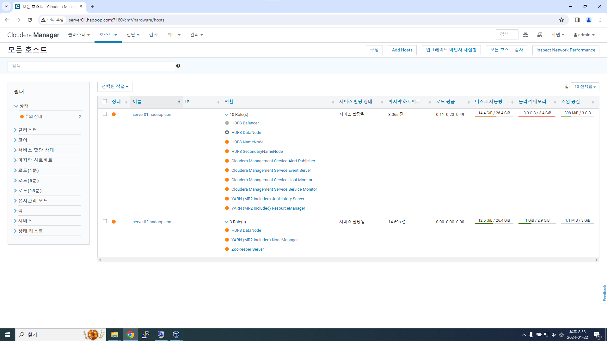

프로젝트의 요구 사항
- 요구사항1 : 차량의 다양한 장치로부터 발생하는 로그 파일을 수집해서 기능별 상태를 점검한다.
- 요구사항2 : 운전자의 운행 정보를 담긴 로그를 실시간으로 수집해서 주행패턴을 분석한다.


아래 내용는 프로젝트를 구성하고 수행하는 내용에 대해서만 작성을 하고, 관련된 용어와 프레임워크에 대한 설명은 각각 다른 문서에서 다룰 예정이다.


1. 수집 요구사항의 구체화

|Specific Requirements|Analysis and Solution Approach|
|--|--|
|스마트카로부터 로그 파일들을 주기적으로 발생|플롬을 이용해 대용량 배치 파일 및 실시간 로그 파일을 수집|
|스마트카의 배치 로그 파일 이벤트를 감지|플럼의 Source 컴포넌트 중, SpoolDir을 이용해서 주기적인 로그 파일 발생 이벤트 감지|
|스마트카의 실시간 로그 발생 이벤트를 감지|플럼의 Source 컴포넌트 중, Exec-Tail을 이용해 특정 로그 파일에서 로그 생성 이벤트를 감지|
|스마트카가 만들어내는 로그 데이터 중 가비지 데이터가  있을 가능성|플럼의 Interceptor를 이용해서 정상 패턴의 데이터만 필터링|
|수집 도중 장애가 발생해도 데이터를 안전하게 보관 및 재처리|플럼의 메모리 중 Channel 및 카프카 Broker 활용으로 로컬 디스크의 파일시스템에 수집 데이터 임시 저장|
|스마트카의 실시간 로그 파일은 비동기 처리로 빠른 수집 처리|플럼에서 수집한 데이터를 카프카 Sink 컴포넌트를 이용해 카프카 Topic에 비동기 전송|


#### 1. SmartCarInfo Agent 생성하기
플럼을 통해 데이터를 수집하기 위해 플럼 에이전트를 생성하고 설정해야 한다.
먼저, Agent 이름을 설정해야 하는데, 구성 파일 내 객체를 구분하는 이름이기 때문에 구성 파일(.conf)와 동일하게 한다면, Agent 이름은 큰 제약은 없다. 여기 Agent를 SeminarNotes_Agent라고 가정하고, 구성 파일을 작성해보겠다. 구성 파일은 Agent가 어떤 파일과 데이터를 읽어, 어떤 동작을 하는지 명세하는 파일이며, 각 구성 정보는 다음과 같은 의미를 갖는다.

먼저, sources, channels, sinks에 대해 정의를 한다.
``` conf
SeminarNotes_Agent.sources = SmartCarInfo_SpoolSource
SeminarNotes_Agent.channels = SmartCarInfo_Channel
SeminarNotes_Agent.sinks = SmartCarInfo_LoggerSink
```

정의된 각 구성요소들의 상세 정보에 대해 값을 작성한다. 소스의 타입은 spoodir를 사용하며, 로그 파일이 생성 되는 위치는 '/home/.../specific-path'이고, 처리된 파일은 즉시(immediate) 삭제하며, 배치 사이즈는 1000으로 한번에 처리할 수 있는 일의 양을 의미한다.
``` conf
SeminarNotes_Agent.sources.SmartCarInfo_SpoolSource.type = spooldir
SeminarNotes_Agent.sources.SmartCarInfo_SpoolSource.spoolDir = /home/.../specific-path
SeminarNotes_Agent.sources.SmartCarInfo_SpoolSource.deletePolicy = immediate
SeminarNotes_Agent.sources.SmartCarInfo_SpoolSource.batchSize = 1000
```

아래는 채널에 대한 내용이다. 채널(channels)은 sources와 sinks 사이에서 중간 버퍼 역할을 수행한다. channels의 tpye은 memory, file, DB 세 가지 경우가 있는데, 그 중 memory의 속도가 가장 빠르다. Capacity/transactionCapacity(수용력/처리수용력)은 각각 10만/1만으로 설정하였다.
``` conf
SeminarNotes_Agent.sources.SmartCarInfo_Channel.type = memory
SeminarNotes_Agent.sources.SmartCarInfo_Channel.capacity = 100000
SeminarNotes_Agent.sources.SmartCarInfo_Channel.transactionCapacity = 10000
```

데이터는 sources와 channels을 통해 sinks로 도착한다. 여기에서는 수집된 데이터를 log로 처리하기 때문에, type을 logger로 설정하였다.
``` conf
SeminarNotes_Agent.sinks.SmartCarInfo_Channel.type = logger
```

마지막 작업은 위에서 구성된 3개의 객체의 채널을 서로 맞춰주는 것인데, sources-channels-sinks의 채널을 모두 동일하게 설정한다.
``` conf
SeminarNotes_Agent.sources.SmartCarInfo_SpoolSource.channels = SmartCarInfo_Channel
SeminarNotes_Agent.sinks.SmartCarInfo_Channel.channels = SmartCarInfo_Channel
```

sources에서 수집된 데이터를 channels로 옮기기 전에 데이터를 가로채(intercept)서, 데이터 전처리를 수행해야 하기 때문에, 위 주석 부분('# [중단부]Interceptor 설정 정보 추가') 위치에 Interceptor에 대한 구성 정보가 추가된다. 
Interceptor 중, 수집된 데이터 중, 가비지 데이터(garbage data)로부터 데이터를 필터링 하기 때문에, filterInterceptor로 구성하고, type은 regular expression(정규식)이며, regex에는 데이터에 대응하는 정규식을 작성한다. 아래에서는 숫자 14자리에 대한 정규식을 작성하였다. excludeEvents는 정규식에 의해 필터링된 데이터는 모두 제외시킨다는 구성 정보이다. 위 정보를 업데이트한 구성 파일은 아래와 같다.
``` conf
SeminarNotes_Agent.sources = SmartCarInfo_SpoolSource
SeminarNotes_Agent.channels = SmartCarInfo_Channel
SeminarNotes_Agent.sinks = SmartCarInfo_LoggerSink

SeminarNotes_Agent.sources.SmartCarInfo_SpoolSource.type = spooldir
SeminarNotes_Agent.sources.SmartCarInfo_SpoolSource.spoolDir = /home/.../specific-path
SeminarNotes_Agent.sources.SmartCarInfo_SpoolSource.deletePolicy = immediate
SeminarNotes_Agent.sources.SmartCarInfo_SpoolSource.batchSize = 1000

# [중단부]Interceptor 설정 정보 추가
SeminarNotes_Agent.sources.SmartCarInfo_SpoolSource.interceptors.filterInterceptor.type = regex_filter
SeminarNotes_Agent.sources.SmartCarInfo_SpoolSource.interceptors.filterInterceptor.regex = ^\d{14}
SeminarNotes_Agent.sources.SmartCarInfo_SpoolSource.interceptors.filterInterceptor.excludeEvents = false

SeminarNotes_Agent.sources.SmartCarInfo_Channel.type = memory
SeminarNotes_Agent.sources.SmartCarInfo_Channel.capacity = 100000
SeminarNotes_Agent.sources.SmartCarInfo_Channel.transactionCapacity = 10000

SeminarNotes_Agent.sinks.SmartCarInfo_Channel.type = logger

SeminarNotes_Agent.sources.SmartCarInfo_SpoolSource.channels = SmartCarInfo_Channel
SeminarNotes_Agent.sinks.SmartCarInfo_Channel.channels = SmartCarInfo_Channel
```

#### 2. 1. DriverCarInfo Agent 생성하기

마지막으로 에이전트에 추가해줄 설정은 DriverCarInfo이다. 수집 해야 하는 로그 정보는 차량에 대한 정보 뿐만 아니라 운전자에 대한 실시간 운행 정보도 수집을 해야해서, 그 데이터를 별도로 관리하기 위해 DriverCarInfo라는 설정을 추가한다. 차량 로그 정보(SmartCarInfo)와 동일하게, 상단부에 sources, channels, sinks에 대해 정의를 한다. 그리고, 하단부 DriverCarInfo에서 사용할 TailSource에 대해 정의를 한다. 차량 로그 정보(SmartCarInfo)의 경우 배치파일로 처리를 하지만, 운전자의 운행 정보는 실시간으로 처리하기 때문에 Type은 exec(실행 파일), command는 로그 파일 내 새롭게 추가된 데이터만 모니터링할 수 있게 'tail -F /home/.../SmartCarDriverInfo.log'로 설정한다. 마지막으로 한꺼번에 처리할 수 있는 작업 단위(batch size)를 1000으로 세팅한다. 추가한 설정 정보는 아래와 같다.

``` conf
# [상단부]DriverCarInfo에 대한 정의 추가
SeminarNotes_Agent.sources = SmartCarInfo_SpoolSource  DriverCarInfo_TailSource
SeminarNotes_Agent.channels = SmartCarInfo_Channel  DriverCarInfo_Chaneel
SeminarNotes_Agent.sinks = SmartCarInfo_LoggerSink  DriverCarInfo_KafkaSink

SeminarNotes_Agent.sources.SmartCarInfo_SpoolSource.type = spooldir
SeminarNotes_Agent.sources.SmartCarInfo_SpoolSource.spoolDir = /home/.../specific-path/
SeminarNotes_Agent.sources.SmartCarInfo_SpoolSource.deletePolicy = immediate
SeminarNotes_Agent.sources.SmartCarInfo_SpoolSource.batchSize = 1000

SeminarNotes_Agent.sources.SmartCarInfo_SpoolSource.interceptors.filterInterceptor.type = regex_filter
SeminarNotes_Agent.sources.SmartCarInfo_SpoolSource.interceptors.filterInterceptor.regex = ^\d{14}
SeminarNotes_Agent.sources.SmartCarInfo_SpoolSource.interceptors.filterInterceptor.excludeEvents = false

SeminarNotes_Agent.sources.SmartCarInfo_Channel.type = memory
SeminarNotes_Agent.sources.SmartCarInfo_Channel.capacity = 100000
SeminarNotes_Agent.sources.SmartCarInfo_Channel.transactionCapacity = 10000

# [하단부]DriverCarInfo에 대한 설정 추가
SeminarNotes_Agent.DriverCarInfo_TailSource.type = exec
SeminarNotes_Agent.DriverCarInfo_TailSource.cammand = tail -F /home/.../SmartCarDriverInfo.log
SeminarNotes_Agent.sinks.SmartCarInfo_Channel.type = logger
SeminarNotes_Agent.DriverCarInfo_TailSource.restart = true
SeminarNotes_Agent.DriverCarInfo_TailSource.batchsize = 1000

SeminarNotes_Agent.sources.SmartCarInfo_SpoolSource.channels = SmartCarInfo_Channel
SeminarNotes_Agent.sinks.SmartCarInfo_Channel.channels = SmartCarInfo_Channel
```

마지막으로, '# 기본구성'에서 DriverCarInfo에 대한 Interceptor를 구성한다. DriverCarInfo의 경우, 실시간으로 수집된 데이터를 카프카로 보내야하기 때문에 '# 카프카 구성'에 Kafka_Sink를 정의한다. 이후, '# 채널 구성'에서 다른 객체와 정보를 서로 주고 받을 수 있도록 채널을 맞추는 세팅을 한다. 

``` conf
SeminarNotes_Agent.sources = SmartCarInfo_SpoolSource  DriverCarInfo_TailSource
SeminarNotes_Agent.channels = SmartCarInfo_Channel  DriverCarInfo_Chaneel
SeminarNotes_Agent.sinks = SmartCarInfo_LoggerSink  DriverCarInfo_KafkaSink

SeminarNotes_Agent.sources.SmartCarInfo_SpoolSource.type = spooldir
SeminarNotes_Agent.sources.SmartCarInfo_SpoolSource.spoolDir = /home/.../specific-path/
SeminarNotes_Agent.sources.SmartCarInfo_SpoolSource.deletePolicy = immediate
SeminarNotes_Agent.sources.SmartCarInfo_SpoolSource.batchSize = 1000

SeminarNotes_Agent.sources.SmartCarInfo_SpoolSource.interceptors.filterInterceptor.type = regex_filter
SeminarNotes_Agent.sources.SmartCarInfo_SpoolSource.interceptors.filterInterceptor.regex = ^\d{14}
SeminarNotes_Agent.sources.SmartCarInfo_SpoolSource.interceptors.filterInterceptor.excludeEvents = false

SeminarNotes_Agent.sources.SmartCarInfo_Channel.type = memory
SeminarNotes_Agent.sources.SmartCarInfo_Channel.capacity = 100000
SeminarNotes_Agent.sources.SmartCarInfo_Channel.transactionCapacity = 10000

SeminarNotes_Agent.DriverCarInfo_TailSource.type = exec
SeminarNotes_Agent.DriverCarInfo_TailSource.cammand = tail -F /home/.../SmartCarDriverInfo.log
SeminarNotes_Agent.sinks.SmartCarInfo_Channel.type = logger
SeminarNotes_Agent.DriverCarInfo_TailSource.restart = true
SeminarNotes_Agent.DriverCarInfo_TailSource.batchsize = 1000

SeminarNotes_Agent.sources.SmartCarInfo_SpoolSource.channels = SmartCarInfo_Channel
SeminarNotes_Agent.sinks.SmartCarInfo_Channel.channels = SmartCarInfo_Channel

# 기본 구성
SeminarNotes_Agent.sources.DriverCarInfo_TailSource.interceptors = filterInterceptor2

SeminarNotes_Agent.sources.DriverCarInfo_TailSource.interceptors.filterInterceptor2.type = regex_filter
SeminarNotes_Agent.sources.DriverCarInfo_TailSource.interceptors.filterInterceptor2.regex = ^\\d{14}
SeminarNotes_Agent.sources.DriverCarInfo_TailSource.interceptors.filterInterceptor2.excludeEvents = false

# 카프카 구성
SeminarNotes_Agent.sinks.DriverCarInfo_KafkaSink.type = org.apache.flume.sink.kafka.KafkaSink
SeminarNotes_Agent.sinks.DriverCarInfo_KafkaSink.topic = SmartCar-Topic
SeminarNotes_Agent.sinks.DriverCarInfo_KafkaSink.brokerList = server02.hadoop.com:9092
SeminarNotes_Agent.sinks.DriverCarInfo_KafkaSink.requiredAcks = 1
SeminarNotes_Agent.sinks.DriverCarInfo_KafkaSink.batchSize = 1000

# 채널 구성
SeminarNotes_Agent.channels.DriverCarInfo_Channel.type = memory
SeminarNotes_Agent.channels.DriverCarInfo_Channel.capacity= 100000
SeminarNotes_Agent.channels.DriverCarInfo_Channel.transactionCapacity = 10000

SeminarNotes_Agent.sources.DriverCarInfo_TailSource.channels = DriverCarInfo_Channel
SeminarNotes_Agent.sinks.DriverCarInfo_KafkaSink.channel = DriverCarInfo_Channel
```


아래에서 설명하는 server01과 server02는 직접 linux 서버를 구성한 것을 기준으로 설명한 것으로, 각 프레임워크는 cloudera를 통해 구축하였으며, host의 구성은 아래와 같다.  

|Name|Roles|
|--|--|
|server01.hadoop.com|HDFS Balancer|
|server01.hadoop.com|HDFS DataNode|
|server01.hadoop.com|HDFS NameNode|
|server01.hadoop.com|HDFS SecondaryNameNode|
|server01.hadoop.com|Cloudera Management Service Alert Publisher|
|server01.hadoop.com|Cloudera Management Service Event Server|
|server01.hadoop.com|Cloudera Management Service Host Monitor|
|server01.hadoop.com|Cloudera Management Service Service Monitor|
|server01.hadoop.com|YARN (MR2 Included) JobHistory Server|
|server01.hadoop.com|YARN (MR2 Included) ResourceManager|
|server02.hadoop.com|HDFS DataNode|
|server02.hadoop.com|YARN (MR2 Included) NodeManager|
|server02.hadoop.com|ZooKeeper Server|


