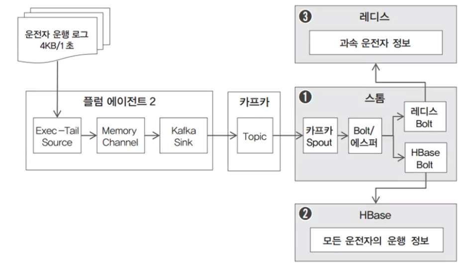
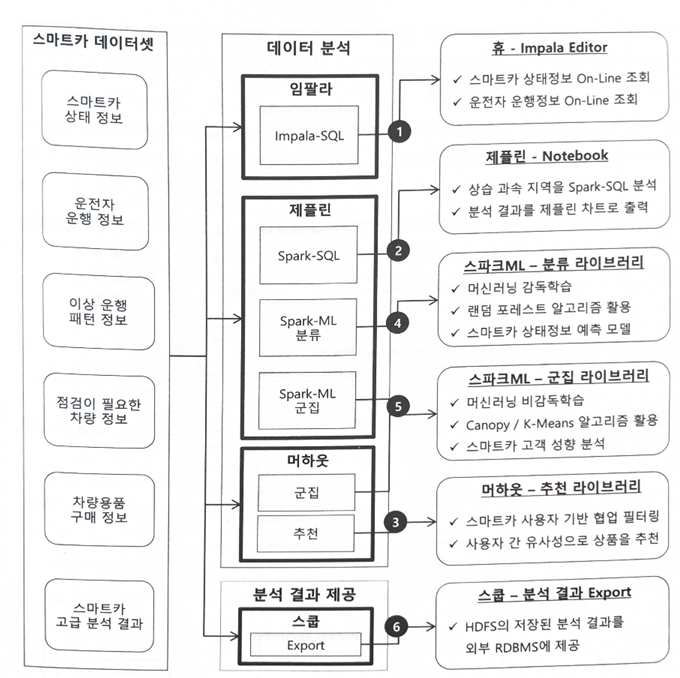

# Pilotproject
최초 작성일 : 2024-01-21  
마지막 수정일 : 2024-01-29
  
## 0. Overview

본 문서에서는 프로젝트의 요구사항을 면밀히 분석하고, 이를 기반으로 단계별로 세부 요구사항을 상세하게 도출하였다. 또한, 분석된 요구사항에 적합한 아키텍처를 설계하고, 이 아키텍처를 바탕으로 소프트웨어(SW) 및 프레임워크(FW)를 구축하며, 구축된 시스템의 성능을 단계별로 단위 테스트하는 과정을 체계적으로 정리하였다. 프로젝트 진행 과정에서 깨달은 중요한 사실은, SW/FW가 기능적 요구사항을 충족하는 것이 매우 중요하지만, 이 과정에서 사용자의 필요와 경험을 소홀히 해서는 안 된다는 점이다. 그래서 이 문서에서는 프로젝트 요구사항, 아키텍처의 전반적인 구조를 중점적으로 다루고, SW/FW는 기능과 역할, 실행 결과물에 대해서만 간략히 언급합니다. 이를 통해, 본 문서는 전체 프로젝트의 구조와 흐름을 명확히 기술하고, SW/FW의 구체적인 기술적 세부사항은 별도의 문서에서 상세히 다루도록 한다.

프로젝트의 주요 목표는 운전자(고객)에게 편의성과 안전성을 제공하는 스마트카 서비스를 개발하기 위해, 수백 대의 IoT 장치로부터 발생하는 스마트카 데이터와 차량 상태 정보를 수집하고 처리하는 빅데이터 시스템을 구축하는 것이다. 구체적으로, 프로젝트는 다음과 같은 요구사항을 해결한다.
 
- 요구사항1 : ***차량의 다양한 장치로부터 발생하는 로그 파일을 수집해서 기능별 상태를 점검***
- 요구사항2 : ***운전자의 운행 정보를 담긴 로그를 실시간으로 수집해서 주행패턴을 분석***

위 요구사항을 바탕으로 각 단계별 세부 요구사항과 관련된 인사이트를 도출한다.


그리고 위 요구사항을 해결하기 위해 구축할 SW/FW의 구조는 아래와 같다.


프로젝트는 "수집 - 적재 - 처리/탐색 - 분석/운용" 순으로 SW/HW를 구현하고 테스트를 하는 식으로 진행된다.

한편, 데이터 엔지니어링 분야에서 빅데이터를 다루기 위해서는 관련된 프레임워크와 소프트웨어를 능숙하게 설치하고 유지보수하는 것이 기능적인 측면에서 기본 업무이자 가장 중요한 업무이다. 그러나 빅데이터와 관련된 프레임워크 및 시스템이 매우 복잡한 아키텍처를 가지고 있기 때문에 빅데이터 기술의 초기 설정과 관리는 심지어 경험이 풍부한 엔지니어들에게도 어려운 작업이다.

구체적으로, 빅데이터 솔루션은 대개 분산 시스템으로 구성되어 있으며, 다수의 컴퓨터 및 서버에서 동시에 작동한다. 이러한 복잡한 아키텍처를 이해하고 올바르게 설정하는 것은 많은 시간과 전문적인 지식이 요구된다. 또한, 각 빅데이터 솔루션/프레임워크는 다양한 구성 옵션과 세부 설정을 가지고 있으며, 어떤 환경에서 어떤 옵션을 선택해야 하는지, 어떻게 최적화해야 하는지 결정하는 것도 많은 경험을 요구한다. 또한, 성능 측면에서 적절한 자원 할당, 하드웨어 및 네트워크 환경을 구축하는 것은 빅데이터 처리 성능에 많은 영향을 미치기 때문에, 시스템을 최적화하여 대량의 데이터 및 처리량를 관리할 수 있도록 환경을 구성 해야 한다.

이러한 문제를 해결하기 위해, 본 프로젝트에서는 다양한 프레임워크를 활용하여, 아키텍처를 구성하고, 전체적인 구조를 설계하고 이해하는 것에 중점을 두었기 때문에 클라우데라(Cloudera)를 활용했다. 클라우데라는 종합적인 빅데이터 솔루션로, Hadoop 기반의 종합적인 빅데이터 솔루션을 제공하기 때문에, Hadoop을 중심으로 HDFS(분산 파일 시스템), MapReduce, YARN 및 기타 주요 빅데이터 프레임워크를 통합하여 데이터 수집, 저장, 처리 및 분석을 한 곳에서 관리하고 모니터링 할 수 있다. 또한, 다양한 프레임워크가 실행되는 동안 해당 컴퓨터의 자원을 실시간으로 모니터링할 수 있는 대시보드도 제공된다. 본 프로젝트에서 HBase나 Storm과 같이 클라우데라에서 지원되지 않는 몇몇 SW/FW를 제외한 나머지 구성은 클라우데라를 통해 해결한다.

## Table of Contents


1. [Big Data Collection](#1.-Big-Data-Collection)
2. [Big Data Ingestion (Loading Large Log Files)](#2.-Big-Data-Ingestion-(Loading-Large-Log-Files))
3. [Big Data Ingestion (Real-time Log/Analysis Loading)](#3.-Big-Data-Ingestion-(Real-time-Log/Analysis-Loading))
4. [Big Data Exploration](#4.-Big-Data-Exploration)
5. [Big Data Analysis](#5.-Big-Data-Analysis)
<!-- 6. [Expanding Analytical Environment](#6.-Expanding-Analytical-Environment) -->


## 1. Big Data Collection
### 1.1. Intro.
데이터 수집은 데이터를 분석하는 과정에서 첫 단계로, 다양한 소스로부터 데이터를 모으는 작업을 의미한다. 이 과정에서 수집할 데이터의 종류와 특성을 정확히 이해하는 것이 중요한데, 일반적으로 데이터는 구조화된 데이터와 비구조화된 데이터, 반구조화된 데이터로 분류된다. 구조화된 데이터는 데이터베이스와 같이 명확한 형식과 순서를 가지며 쉽게 검색, 접근이 가능한 데이터이다. 반면, 비구조화된 데이터는 텍스트 문서, 이미지, 비디오 등과 같이 정해진 형식이나 구조가 없는 데이터이며, 반구조화된 데이터는 이메일, XML 파일 등 구조화되지 않은 데이터에 일정한 구조를 부여한 데이터이다.

|데이터 유형|예시|
|--|--|
|정형 데이터|데이터 베이스(관계/계층/객체/네트워크)|
|반정형 데이터|HTML, XML, JSON, SERVER LOG|
|비정형 데이터|소셜 미디어, 문서, 이미지, 오디오, 비디오, 사물인터넷(IoT)|

데이터 유형 뿐만 아니라 수집 단계에서 데이터를 어떤 방법으로 수집할지도 고민해야 한다. 대표적인 데이터 수집 방법은 아래와 같다.
|방법|설명|
|--|--|
|웹 스크래핑|웹사이트에서 데이터를 추출하는 방법으로, 소셜 미디어, 뉴스 사이트, 전자 상거래 사이트 등에서 데이터를 수집|
|API 사용|많은 서비스에서 데이터 접근을 위해 API를 제공하며, API를 통해 정기적으로 데이터를 수집|
|IoT 디바이스|센서나 스마트 디바이스들은 실시간으로 데이터를 수집|
|로그 파일 분석|웹서버, 애플리케이션 서버, 보안 시스템 등은 사용자의 활동이 로깅되어 로그 파일을 수집|


### 1.2. Requirements Analysis

위 요구 사항을 해결하기 위해, 수집 단계에 대한 세부 요구사항을 구체화하면, 아래 표와 같다.

|Specific Requirements|List to do|
|--|--|
|스마트카로부터 로그 파일들을 주기적으로 발생|플롬을 이용해 대용량 배치 파일 및 실시간 로그 파일을 수집|
|스마트카의 배치 로그 파일 이벤트를 감지|플럼의 Source 컴포넌트 중, SpoolDir을 이용해서 주기적인 로그 파일 발생 이벤트 감지|
|스마트카의 실시간 로그 발생 이벤트를 감지|플럼의 Source 컴포넌트 중, Exec-Tail을 이용해 특정 로그 파일에서 로그 생성 이벤트를 감지|
|스마트카가 만들어내는 로그 데이터 중 가비지 데이터가  있을 가능성|플럼의 Interceptor를 이용해서 정상 패턴의 데이터만 필터링|
|수집 도중 장애가 발생해도 데이터를 안전하게 보관 및 재처리|플럼의 메모리 중 Channel 및 카프카 Broker 활용으로 로컬 디스크의 파일시스템에 수집 데이터 임시 저장|
|스마트카의 실시간 로그 파일은 비동기 처리로 빠른 수집 처리|플럼에서 수집한 데이터를 카프카 Sink 컴포넌트를 이용해 카프카 Topic에 비동기 전송|

따라서, 위 작업을 수행하기 위해, 먼저 flume과 kafka의 설치와 설정이 필요하였다. 해당 작업은 cloudera를 통해 쉽게 해결하였고, 데이터를 송수신 할 수 있도록, Agent를 구성하고, 기초적인 활용방법과 메커니즘에 대해 알아보았다.
Agent에 대한 세부적인 내용도 중요한 부분이긴 하지만, 프로젝트의 전체적인 흐름을 설명하는 이 문서에서는 너무 지엽적인 문제라 우선 삭제하였다.
각 프레임워크에 대한 활용 방법을 익히고, 실제 Java에 의한 로그 생성을 작동하여, 각 프레임워크가 데이터를 수집하는지 수집 기능 테스트를 수행하였다.

### 1.3. Architecture Analysis


### 1.4. Execution Results
왼쪽 화면 내, JAVA(.jar)에 의한 로그 시뮬레이터에서 로그파일을 실시간으로 생성하는 것이고, Kafka consumer를 통해 생성된 로그 파일을 수신하는 것 모습이다. 마지막 CLI 화면은 flumer이다.

오른쪽 화면 내, Cloudera Manager가 Cluster에 포함된 각종 Framework의 설치 및 실행, 상태에 대해 모니터링할 수 있도록 UI를 제공하고 있고, Framwork의 동작에 따라 컴퓨터와 서버의 자원도 모니터링 하여 사용자에게 정보를 제공한다.


### 1.5. Reflections
- Cloudera를 사용하며, 각종 Framework와 아키텍처를 구성하는 것에 대해 매우 편리함을 느꼈다.
- 각 Framework 내 configuration를 정확하게 작성하기 위해서는 각 conponent와 agent가 수행하는 역할에 대해 올바르게 이해하고 있어야 한다.
- data, file을 어느 객체가 어디에서 어디로 전송하는지 이해하고, pipeline을 구축해야 한다.
- node, pipeline에 대해서는 사용자가 꼼꼼히 확인하여 입력해야하며, 이를 위해 데이터 엔지니어는 항상 구조를 이해하고 기억하고 있어야겠다는 생각을 했다.
- 생각보다 각 module 또는 agent 단위가 파일을 읽고, 쓰는 행위가 많다. 따라서, command line 입력 외에 대부분의 에러는 agent가 파일에 접근할 때 발생하는 에러일 것이라 예상한다.
 


## 2. Big Data Ingestion (Loading Large Log Files)

### 2.1. Intro.

데이터를 적재하기 위해서는 원천 데이터의 종류, 수집 주기, 적재 저장소 유형을 모두 고려해야 한다. 각 개념은 아래와 같이 구분된다.
적재에는 크게 2가지가 있는데, 대용량 파일을 적재하는 것과 실시간 메세지를 적재하는 것이 존재한다. 그리고 전자는 배치성 처리, 후자는 실시간성 처리라고 한다.
이에 대해 더 자세히 말하자면, 

|원천 데이터 유형|예시|
|--|--|
|정형 데이터|데이터 베이스(관계/계층/객체/네트워크)|
|반정형 데이터|HTML, XML, JSON, SERVER LOG|
|비정형 데이터|소셜 미디어, 문서, 이미지, 오디오, 비디오, 사물인터넷|

|수집 유형|저장소 유형|예시|
|--|--|--|
|배치성 수집|대용량 파일 전체 영구 저장|분산 파일 시스템|
|실시간 수집|대규모 메세지 전체 영구 저장|No-SQL|
|실시간 수집|대규모 메세지 전체 버퍼링 처리|MoM|
|실시간 수집|대규모 데이터 일부 임시 저장|Cached(In-memory)|


### 2.2. Requirements Analysis
이번 단계에서는 ***차량의 다양한 장치로부터 발생하는 로그파일을 수집해서 기능별 상태를 점검한다***(요구사항1)에 대해 구현한다. 위 요구 사항을 적재에 맞게끔 아래와 같이 다시 정리할 수 있다.

|Specific Requirements|List to do|
|--|--|
|100대에 달하는 스마트카들의 상태 정보가 일 단위로 취합되어 제공|플럼에서 수집 발생 시점의 날짜를 HdfsSink에 전달해서 해당 날짜 단위로 적재|
|매일 100대의 스마트카 상태 정보는 약 100MB 정도이며, 220만 건의 상태 정보 발생|1년 적재 시 8억 건 이상의 데이터가 적재되며, 연 단위 분석에 하둡의 분산 병렬 처리 사용|
|스마트카의 상태 정보 데이터의 발생일과 수집/적재되는 날짜가 다를 가능성|수집/적재되는 모든 데이터마다 데이터 발생일 외에 수집/적재 처리돼야 하는 처리일 추가|
|적재된 스마트카들의 상태 정보를 일/월/년 단위로 분석해야함|HDFS에 수집 일자별로 디렉터리 경로를 만들어 적재|
|적재 및 생성되는 파일은 HDFS의 특징을 고려해야함|플럼의 HdfsSink의 옵션을 파일럿 프로젝트의 HDFS에 최적화하여 설정|
|적재가 완료된 후에는 원천 파일 삭제|플럼의 Source 컴포넌트 중 SpoolDir의 DeletePolicy 옵션 활용|

### 2.3. Architecture Analysis


### 2.4. Execution Results

이번 장에서는 빅데이터 대용량 파일 적재에 대한 기본 개념과 적재 수행을 위해서 Hadoop 내 HDFS, Flume, Zookeeper의 기능, 아키텍쳐에 대해 공부하고, 이를 활용하여 데이터 수집 프로세르를 구현하였다.

아래는 로그 시뮬레이터를 이용해서, 파일(SmartCarStatusInfo_20200102.txt)을 생성하고, Flume이 인식하여, 데이터를 수집할 수 있도록 /var/log/flume-ng/ 폴더로 옮겼다. 이 후, 아래 명령어를 통해 flume의 로그를 확인하여, 동작하는 것을 모니터링 하였다.
```
$ tail -f flume-cmf-flume-AGENT-server02.hadoop.com.log
```


아래는 Flume을 통해 HDFS에 파일이 적재된 것을 확인하기 위해 hdfs 명령어를 활용하여, 파일과 파일 내 로그 데이터를 확인하였다.

```
# 로그 파일 확인
$ hdfs dfs -ls -R /pilot-pjt/collect/car-batch-log

# 하나의 로그 파일 데이터 확인
$ hdfs dfs -tail /pilot-pjt/collect/car-batch-log/wrk_date=20240128/car-batch-log.1706410302520.log
```
정상적으로 파일과 데이터가 적재되었음을 확인함으로써, Flume의 이벤트 작동과 적재 기능 테스트를 완료하였다. 이 후, Framework와 서버를 종료하였다.


### 2.5. Reflections  
- CLI로 이루어진 프로그램에서 로그를 꼼꼼히 읽어야 한다는 점을 문득 느끼게 되었다.
- 4번을 통해 성공적으로 해당 단계를 완료하였으며, 중간에 Flume에 대한 로그를 확인하였을 때, 대게 5분 정도 소요되는 작업이 아래와 같은 화면의 상태로 8시간 이상 되어도 동작이 수행되지 않는 트러블 슈팅이 있었다. 해당 트러블 슈팅은 Cloudera에서 모든 Framework를 완전히 종료(정지)하고, Server를 저장하고, 컴퓨터 재부팅 후, 다시 시도하여 해결하였다. 정확한 원인을 파악하지 못하였지만, 구성 파일(.conf) 업데이트 후, flume의 재시작 시, 구성이 재대로 반영되지 않은 부분이라 추측하고 있다.


## 3. Big Data Ingestion (Real-time Log/Analysis Loading)   
### 3.1. Intro.
실시간 데이터 처리가 높은 난이도를 갖는 이유는 다음과 같다.
먼저, 실시간 데이터는 데이터가 빠른 속도로 발생하고, 오랜 시간에 걸쳐 발생하고, 대규모로 발생한다는 점이다.
둘째, 실시간으로 발생하는 데이터를 반영한 처리하고, 분석하는 아키텍처를 고민해야 한다
셋째, 하루에 약 수억개의 데이터가 발생하는 것이 보통이기에 일반적인 데이터베이스를 사용하는 경우, 오버헤드 에러가 발생할 수 있다. 따라서, 상황과 조건에 맞는 적절한 프레임워크나 데이터베이스를 조사하여 선택해야한다.
마지막으로, 에러/장애가 발생하는 경우, 복구가 되더라도 상당한 양의 데이터 유실이 발생한다. 이러한 상황을 어떻게 대비할 것인지에 대해 예외처리를 고려해야한다.

이러한 실시간 수집을 위해 사용하는 데이터베이스(저장소)는 다음과 같다.

|수집 유형|저장소 유형|예시|
|--|--|--|
|실시간 수집|대규모 메세지 전체 영구 저장|No-SQL|
|실시간 수집|대규모 메세지 전체 버퍼링 처리|MoM|
|실시간 수집|대규모 데이터 일부 임시 저장|Cached(In-memory)|

### 3.2. Requirements Analysis
위 요구사항은 이번 단계에서는 "요구사항 2: 운전자의 운행 정보가 담긴 로그를 실시간으로 수집해서 주행패턴을 분석한다"에 대해 아키텍쳐를 구성하고, 구현한다. 먼저, 해당 요구사항을 구체화 하면 아래 표와 같다.

|Specific Requirements|List to do|
|--|--|
|1초 간격으로 발생하는 100명의 운행 정보(운행 정보 1건 : 약 4KB)는 손실 없이 적재해야 한다.|카프카와 스톰을 이용해 수집한 데이터에 대해 분산 처리 및 무결성을 보장하며, 분산 처리가 완료된 데이터는 HBase에 적재|
|적재한 운행 정보를 대상으로 조건 검색이 가능해야 하며, 필요 시 수정도 가능해야 한다.|HBase의 테이블에 적재된 데이터는 스캔 조건으로 검색하며, 저장(Put) 기능을 이용해 기적재한 데이터에 대해 칼럼 기반으로 수정|
|운전자의 운행 정보 중 30초를 기준으로 평균 속도가 80km/h를 초과한 정보는 분리 적재한다|에스퍼의 EPL에서 사용자별 운행 정보를 그루핑하고, 30초의 윈도우 타임(Window Time)조건으로 평균 시속 집계 및 임계치별 이벤트를 정의|
|과속한 차량을 분리 적재하기 위한 조건은 별도의 룰로 정의하고 쉽게 수정할 수 있어야 한다|과속 기준을 80km/h에서 100km/h로 변경해야 할 경우 EPL의 평균 속도를 체크하는 조건값만 수정|
|분리 적재한 데이터는 외부 애플리케이션이 빠르게 접근하고 조회할 수 있게 해야 한다.|실시간 이벤트로 감지된 데이터는 인메모리 기반 저장소인 레디스에 적재해서 외부 애플리케이션에서 빠르게 조회|
|레디스에 적재한 데이터는 저장소의 공간을 효율적으로 사용하기 위해 1주일이 경과하면 영구적으로 삭제한다|레디스 클라이언트 라이브러리인 제디스(jedis) 클라이언트를 이용해 데이터 적재 시 만료(Expire) 시간을 설정해 자동으로 영구 삭제 처리|

### 3.3. Architecture Analysis
위 세부 요구사항을 수행하기 위해 구축하고자 하는 아키텍처는 아래와 같다.

<!--  -->


- 카프카 spout가 카프카에서 데이터를 로드하여, 에스퍼가 적용된 Bolt가 라우팅을 하여, 과속 차량을 판단한다.
- 과속 차량에 해당하는 경우, 운전자 정보를 레디스 Bolt에 전달하여, 레디스에 저장한다.
- 카프카로부터 로드한 모든 운전자 정보는 HBase Bolt에 전달되어, HBase에 저장한다.

### 3.4. Execution Results


### 3.5. Reflections  

Redis는 Cloudera 환경에서 설치할 수 없어서 서버 환경에서 yum 명령어를 이용해서 직접 설치를 했어야 했다.
```
$ yum install -y gcc*
$ yum install -y tcl
```

하지만, 쉽게 풀릴 내 하루가 아니기 때문에, 정말 .. 정말 간단한 설치 Command인데 에러가 발생했다.
```
[root@server02 ~]# yum install -y gcc*
Loaded plugins: fastestmirror, refresh-packagekit, security
Setting up Install Process
Determining fastest mirrors
YumRepo Error: All mirror URLs are not using ftp, http[s] or file.
 Eg. Invalid release/repo/arch combination/
removing mirrorlist with no valid mirrors: /var/cache/yum/x86_64/6/base/mirrorlist.txt
Error: Cannot find a valid baseurl for repo: base
[root@server02 ~]#

[root@server02 ~]# yum install -y tcl
Loaded plugins: fastestmirror, refresh-packagekit, security
Setting up Install Process
Loading mirror speeds from cached hostfile
https://archive.cloudera.com/cm6/6.3.1/redhat6/yum/repodata/repomd.xml: [Errno 14] PYCURL ERROR 22 - "The requested URL returned error: 404 Not Found"
Trying other mirror.
To address this issue please refer to the below knowledge base article

https://access.redhat.com/articles/1320623

If above article doesn't help to resolve this issue please open a ticket with Red Hat Support.

Error: Cannot retrieve repository metadata (repomd.xml) for repository: cloudera-manager. Please verify its path and try again
```


tcl에 대한 정보는 많이 없었지만, gcc 설치에 대한 자료는 많이 찾을 수 있었다. 가장 쉽게 찾을 수 있는 정보에 의하면, linux 비트를 확인하고 아래 command를 입력한다.
```
[root@server02 ~]# getconf LONG_BIT
64

$ echo "https://vault.centos.org/6.10/os/x86_64/" > /var/cache/yum/x86_64/6/base/mirrorlist.txt
$ echo "http://vault.centos.org/6.10/extras/x86_64/" > /var/cache/yum/x86_64/6/extras/mirrorlist.txt
$ echo "http://vault.centos.org/6.10/updates/x86_64/" > /var/cache/yum/x86_64/6/updates/mirrorlist.txt
```

근데 ? 또 에러가 났다. 역시 대단한 나의 하루다.
그래서 또.. 한 두시간 정도 해결 방법을 찾기 위해 삽질을 했다.

```
$ rm /etc/yum.repos.d/cloudera-manager.repo
$ echo "http://vault.centos.org/6.10/os/x86_64/" > /var/cache/yum/x86_64/6/base/mirrorlist.txt
$ echo "http://vault.centos.org/6.10/extras/x86_64/" > /var/cache/yum/x86_64/6/extras/mirrorlist.txt
$ echo "http://vault.centos.org/6.10/updates/x86_64/" > /var/cache/yum/x86_64/6/updates/mirrorlist.txt
$ yum install -y gcc* 
$ yum install -y tcl
```
위 해결 방법으로 설치를 완료하였다. 사실 해결방법을 먼저 찾고, 발생되었던 문제점과 해결방법을 이용해 chatGPT에게 원인이 무엇인지 물어보니,
```
chatGPT : 해결 방법으로 아래의 단계를 수행하였는데, 이로 인해 Cloudera 저장소 설정 파일 (/etc/yum.repos.d/cloudera-manager.repo)을 삭제하고 CentOS Vault 저장소를 대체하는 설정을 추가하였습니다. 그런 다음 필요한 패키지를 다시 설치한 것 같습니다.
```
요약하면, 원인은 cloudera-manager 저장소의 repomd.xml 파일에 접근할 수 없거나, 저장소 경로가 더 이상 유효하지 않은 부분이었다 그래서, 해결 방법은 해당 저장소 설정을 제거하고, CentOS 6.10의 저장소로 변경하여 YUM이 유효한 저장소에서 패키지를 찾을 수 있도록 command를 입력한 거다. 


## 4. Big Data Exploration
### 4.1. Intro.
### 4.2. Requirements Analysis
|Specific Requirements|List to do|
|--|--|
|스마트카로부터 로그 파일들을 주기적으로 발생|플롬을 이용해 대용량 배치 파일 및 실시간 로그 파일을 수집|
|스마트카의 배치 로그 파일 이벤트를 감지|플럼의 Source 컴포넌트 중, SpoolDir을 이용해서 주기적인 로그 파일 발생 이벤트 감지|
|스마트카의 실시간 로그 발생 이벤트를 감지|플럼의 Source 컴포넌트 중, Exec-Tail을 이용해 특정 로그 파일에서 로그 생성 이벤트를 감지|
|스마트카가 만들어내는 로그 데이터 중 가비지 데이터가  있을 가능성|플럼의 Interceptor를 이용해서 정상 패턴의 데이터만 필터링|
|수집 도중 장애가 발생해도 데이터를 안전하게 보관 및 재처리|플럼의 메모리 중 Channel 및 카프카 Broker 활용으로 로컬 디스크의 파일시스템에 수집 데이터 임시 저장|
|스마트카의 실시간 로그 파일은 비동기 처리로 빠른 수집 처리|플럼에서 수집한 데이터를 카프카 Sink 컴포넌트를 이용해 카프카 Topic에 비동기 전송|

### 4.3. Architecture Analysis


### 4.4. Execution Results
### 4.5. Reflections


## 5. Big Data Analysis
### 5.1. Intro.
### 5.2. Requirements Analysis
|Specific Requirements|List to do|
|--|--|
|스마트카 데이터셋을 더 빠르게 탐색 및 분석한다.|임팔라를 이용해 기존 하이브 배치 쿼리를 임팔라의 온라인 쿼리로 실행해서 결과 확인|
|스마트카 데이터셋의 탐색 결과를 이해하기 쉽도록 시각화한다.|제플린을 이용해 스파크-SQL로 탐색한 데이터셋을 다양한 차트로 표현|
|차량용품 구매 이력을 구매해 최적의 상품 추천 목록을 만든다.|머하웃의 추천을 이용해 차량 용품 구매 이력을 분석해 성향에 따른 상품 추천 목록을 생성|
|스마트카의 상태 정보를 분석해 이상 징후를 예측한다.|스파크ML의 머신러닝 기법 중 분류 감독 학습을 통해 이상 징후에 대한 예측 모델을 구성|
|스마트카 운전자의 마스터 정보를 분석하고 고객 군집을 도출한다.|머하웃과 스파크ML로 비지도 학습인 군집 분석을 수행|
|분석 결과는 외부 업무 시스템의 RDBMS에 제공되어야 한다.|스쿱의 데이터 익스포트 기능을 이용해 HDFS에 저장된 분석 결과를 RDBMS로 전달|

### 5.3. Architecture Analysis




### 5.4. Execution Results
### 5.5. Reflections
